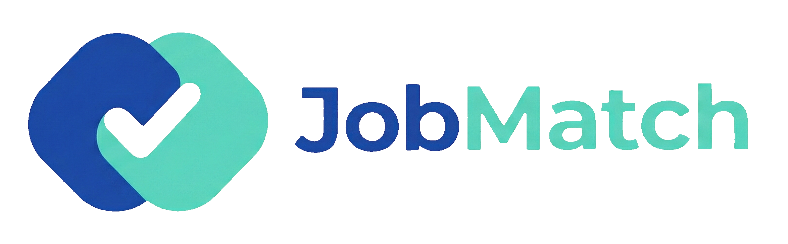

# <div align="center"><a href="https://brau.io"></a></div>

## Job Match v0.1.0

[](https://x.com/_brau_io)
[](https://www.python.org/)
[](https://sqlite.org/)
[](https://flask.palletsprojects.com/en/stable/)

Serviço de avaliação de currículos para avaliar o grau de aderência do currículo com a vaga.

Job Match é criado e mantido por [Bráulio Figueiredo](http://braulioti.com.br).
Novas atualizações do projeto podem ser acompanhadas através do X:
[@_brau_io](https://x.com/_brau_io).

## Índice

- [Estrutura do Projeto](#estrutura-do-projeto)
  - [Aplicação Desktop](#aplicação-desktop)
  - [Projeto Backend API](#projeto-backend-api)
- [Requisitos](#requisitos)
- [Instalação](#instalação)
- [Build da Versão Desktop](#build-da-versão-desktop)
- [Projeto Backend API](#projeto-backend-api-1)
  - [Health Check Endpoint](#health-check-endpoint)
  - [API v1](#api-v1)
- [Versionamento](#versionamento)
- [Autor](#autor)

## Estrutura do Projeto

### Aplicação Desktop

```
desktop/
├── main.py                 # Ponto de entrada da aplicação
├── requirements.txt        # Dependências do projeto
├── build.spec             # Configuração do PyInstaller para compilação
├── build.py               # Script de build para Windows (Python)
├── servers                 # Arquivo com lista de servidores disponíveis
├── images/                # Imagens e ícones da aplicação
│   ├── favicon.ico        # Ícone da aplicação
│   ├── favicon.png        # Favicon em formato PNG
│   └── job_match_logo.png # Logo do Job Match
├── scripts/               # Scripts SQL de inicialização do banco
│   └── 001-Create_Table_Project.sql  # Script de criação da tabela project
└── src/                   # Código fonte
    ├── __init__.py
    ├── app.py             # Classe principal da aplicação
    ├── ui/                # Componentes de interface
    │   ├── __init__.py
    │   ├── main_window.py        # Janela principal
    │   ├── new_project_dialog.py # Diálogo de cadastro de projeto
    │   ├── about_dialog.py       # Diálogo sobre a aplicação
    │   ├── configuration_dialog.py # Diálogo de configurações
    │   └── builders/      # Builders de componentes UI
    │       ├── __init__.py
    │       └── main_menu.py       # Builder do menu principal
    ├── database/          # Gerenciamento de banco de dados
    │   ├── __init__.py
    │   └── db.py          # Classe de gerenciamento do banco SQLite
    ├── manager/           # Gerenciadores de configuração e recursos
    │   ├── __init__.py
    │   ├── base_manager.py        # Classe base para managers
    │   ├── config_manager.py      # Gerenciador de configurações (config.ini)
    │   └── server_manager.py      # Gerenciador de servidores
    ├── interfaces/        # Interfaces e tipos de dados
    │   ├── __init__.py
    │   └── server.py      # Interface para estrutura de servidor
    ├── integration/       # Integrações com serviços externos
    │   ├── __init__.py
    │   └── server_integration.py  # Integração com servidores
    ├── utils/             # Funções utilitárias
    │   ├── __init__.py
    │   └── helpers.py
    └── config/            # Configurações
        ├── __init__.py
        └── settings.py
```

### Projeto Backend API

```
API/
├── app.py              # Aplicação principal Flask
├── requirements.txt    # Dependências do projeto
├── README.md          # Documentação da API
├── config/            # Configurações
│   ├── __init__.py
│   └── settings.py
├── routes/           # Rotas da API
│   ├── __init__.py
│   └── routes.py
├── models/           # Modelos de dados
│   ├── __init__.py
│   └── models.py
└── utils/            # Funções utilitárias
    ├── __init__.py
    └── helpers.py
```

## Requisitos

- Python 3.8 ou superior
- Tkinter (incluído com Python)
- SQLite (Aplicação Desktop)
- Flask 3.0.0 ou superior

## Instalação

1. Ative o ambiente virtual (se estiver usando):
```bash
# Windows PowerShell
.\venv\Scripts\Activate.ps1

# Windows CMD
.\venv\Scripts\activate.bat
```

2. Instale as dependências:
```bash
pip install -r requirements.txt
```

## Versão Desktop

### Build da versão

Para compilar a aplicação em um executável standalone, execute o script de build:

```bash
cd desktop
python build.py
```

O script irá:
- Limpar builds anteriores (pasta `build` e `dist`)
- Compilar a aplicação usando PyInstaller
- Gerar o executável `JobMatch.exe` na pasta `dist`

O executável será criado em: `desktop/dist/JobMatch.exe`

### Arquivos e pastas que precisam ser distribuídos

<div style="border-left: 4px solid #f44336; padding: 12px; margin: 16px 0;">
<strong style="color: #c62828;">⚠️ IMPORTANTE:</strong> Para que a aplicação funcione corretamente, alguns arquivos e pastas deverão ser distribuídos junto com o arquivo <code>JobMatch.exe</code>
</div>

É necessário copiar os seguintes arquivos/pastas para a pasta dist antes de iniciar o projeto
- images
- scripts
- servers

### Configurações do arquivo servers

Quando a aplicação for iniciada, o arquivo servers é carregado com a lista de servidores do projeto. Em tempo de desenvolvimento, você pode ajustar o arquivo da seguinte forma:
 ```
 Servidor Oficial do Projeto;https://job-match-api.brau.io
 Servidor Local;http://localhost:5000;default
 ```
Desta forma você terá dois servidores disponíveis para poder utilizar, o oficial do projeto e o seu localhost.
Caso queira subir a aplicação em um servidor dentro da sua empresa, basta adicionar outras linhas no arquivo servers

## Projeto Backend API

### Health Check Endpoint
- **GET** `/health`
    - Retorna o status da API

### API v1
- Todos os endpoints da API estão disponíveis em `/api/v1`

## Versionamento

Job Match utiliza as diretrizes do "Semantic Versioning" sempre que possível.
As atualizações são numeradas da seguinte forma:

`<maior>.<menor>.<correção>`

Construído sobre as seguintes diretrizes:

* Quebra de compatibilidade com a versão anterior será atualizado em "maior"
* Novas implementações e funcionalidades em "menor"
* Correção de erros em "correção"

Para mais informações sobre o SemVer, por favor visite http://semver.org.

## Autor
- Email: braulio@braulioti.com.br
- X: https://x.com/_brau_io
- GitHub: https://github.com/braulioti
- Website: http://brau.io

